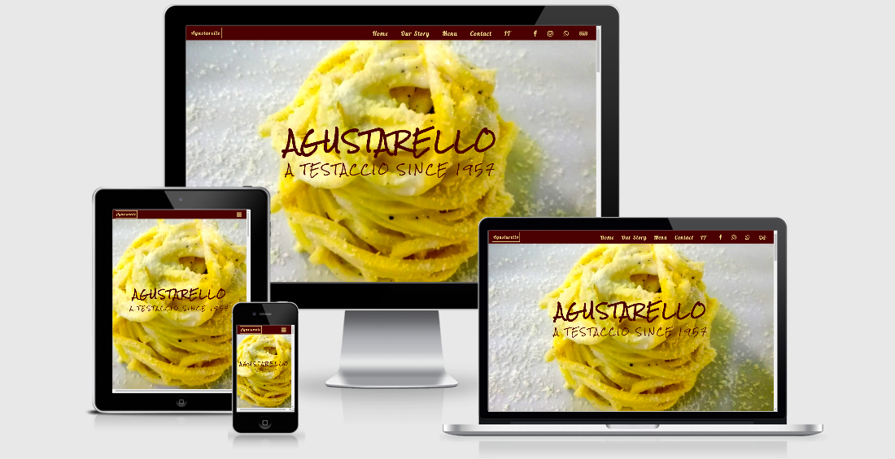

# [Agustarello - Restaurant in Rome](https://acommentucci.github.io/Restaurant-Agustarello/)

# Intro
This is a website for a restaurant in Rome. It's my father's restaurant, it used to be my grandfather's restaurant. A long tradition of genuine food and
typical cuisine... But he had never had a website.

#### A live demo can be found [here](https://acommentucci.github.io/Restaurant-Agustarello/)

# Table of content
- Intro
- Description
- UX
   - *User Stories*
   - *Strategy*
   - *Scope*
   - *Structure*
   - *Skeleton*
   - *Surface*
- Tecnologies
   - *Frameworks*
   - *Libraries and programs*
   - *Other resources*
- Testing
   - *User stories Testing*
   - *Website Testing*
- Project barrier and solutions
- Deployment
- Credits
   - *Media*
   - *Text*
   - *Code snippets*
   - *Thanks to*

# Description
Agustarello is a family-run restaurant in the center of Rome. Its strengths are in the quality of the food and in the rustic and welcoming environment. 
Agustarello is a reference point in Rome for both local customers and tourists and for all those who want to experience the atmosphere of an authentic Roman 
*trattoria*.

# UX
According to [research](https://restaurant.opentable.com/news/insider-information/heres-what-diners-do-online-before-they-eat-out-are-you-prepared/) 
commissioned by **Opentable**, over 80% of potential customers visit a restaurant's website before deciding whether or not to go there. 
On the data that emerged from the research and on my personal working experience I based the user stories.
## **User Stories**
  - **As a customer:**
    - I want to book a table by the restaurant website so I can check tha availabity of timing withouth calling the place
    - I want to check out a menu so I can see what kind of cuisine the restaurant is and how much is expensive
    - I want to get direction for the restaurant so I can decide wich way is the best to get there (car or public transport)
    - I want to see some picture of the place and the food so I can get an early idea of the place
    - I want to see some reviews from other customers who already been there because I trust of the reviews in internet

  - **As the owner:** 
    - I want to have a better web presence so I can be found when people looking for my restaurant.
    - I want to discourage phone calls so I can use my time otherways than answering phone calls.
    - I want to explain how to get to the restaurant, by public transport or car and where to park close to the restaurant so customers dosn't change their mind.
    - I want to introduce the history of the place and the type of traditional cuisine because I'm very proud of it.
## **Strategy**
The website was designed to meet the needs of the owner and the consumers. The main purpose is to increase the online presence of the business which allows 
potential customers to obtain information about the restaurant. The owner wanted to manage his online presence directly and not only through review sites 
or search engines. 
## **Scope**
The website wants to be a showcase of the restaurant. The visitor can get all the information he wants to get an idea and avoid contacting the owner directly 
for anything other than booking a table. 
A feature that is not present but that must be implemented in the future will be that of being able to make reservations through the website.
## **Structure**
The structure of the site is a prevalence of images over text. Very short paragraphs and captivating images of the dishes on the menu. A lot of attention
the other social profiles will be provided with the map of the area and the way to reach the restaurant.
## **Skeleton**
Scrolling website with four main section: HOME - OUR STORY - MENU - CONTACT

Wireframes:
- [Desktop](./assets/wireframes/desktop-wireframes.png)
- [Tablet](./assets/wireframes/tablet-wireframes.png)
- [Mobile](./assets/wireframes/mobile-wireframes.png)

In the mobile and tablet version there is a fifth page, a full-screen navigation menu that user can access from a *burger* icon.
- [Menu Tablet](./assets/wireframes/menu-tablet.png)
- [Menu Mobile](./assets/wireframes/menu-mobile.png)

In the desktop version ther is a fixed navigation bar on top:
- [Menu Desktop](./assets/wireframes/menu-desktop.png)
## **Surface**
As for the choice of colors, I used a burgundy red and a light yellow which, in addition to being the colors of the coat of arms of the city of Rome, are also shades that go well with food and catering. For the choice of the right gradation I helped myself with [Coolors](https://coolors.co/).

I chose "Rock Salt" for the main titles and "Lobster" for the paragraphs and the navigation bar both imported into the css file via [GoogleFonts](https://fonts.google.com/). Both allow for a fair compromise between aesthetics and clarity. I chose "rock salt" in particular because it conveys a sense of "homemade".

All images are owned by the author and have been resized and edited with [Adobe](https://www.adobe.com/ie/photoshop/online/resize-image.html) and compressed with [Tinypng](https://tinypng.com/).

# Technologies Used
## **Languages**
- [HTML5](https://en.wikipedia.org/wiki/HTML5)
- [CSS3](https://en.wikipedia.org/wiki/CSS)
## **Frameworks, Libraries & Programs**
- [Bootstrap 4.6:](https://getbootstrap.com/docs/4.6/getting-started/introduction/)
   - Bootstrap is a free front-end framework used for responsiveness and styling.
- [Hover.css:](https://ianlunn.github.io/Hover/)
   - Hover.css was used for the navbar and the social icons.
- [Animate.css:](https://animate.style/)
   - Animate.css was used for the animation in the home page.
- [Google Fonts:](https://fonts.google.com/)
   - Google fonts were used to import "Rock Salt" and "Lobster" fonts.
- [Font Awesome:](https://fontawesome.com/)
   - used for providing social media icons and "back-to-the-top arrow"
- [jQuery:](https://jquery.com/)
   - jQuery came with Bootstrap to make the Carousel in the "Menu" section.
- [Git:](https://git-scm.com/)
   - Version Control.
- [GitHub:](https://github.com/)
   - Save the project online.
- [GitPod:](https://gitpod.io/)
   - Online IDE used with Code Institute Template.
- [Balsamiq:](https://balsamiq.com/)
   - Design the [wireframes](https://github.com/acommentucci/Restaurant-Agustarello/tree/master/assets/wireframes).
- [Am I Responsive?](http://ami.responsivedesign.is/)
   - Check the responsiveness of the website.
- [Coolors](https://coolors.co/)
    - Color scheme generator.
## **Other Resources**
- [YouTube](https://www.Youtube.com)
- [W3Schools](https://www.w3schools.com/)
- [Stack-Overlflow](https://stackoverflow.com/)
- [CSS-Tricks](https://css-tricks.com/)

## Project Barriers and solution
FontAwesome Icon: I was unable to see the icons I placed in the code. I tried to change the CDN, to look for an answer on the official site of FontAwesome or through the blogs that dealt with the subject I found out where I was wrong thanks to StackOverflow. I used the "fas" class copied from the official site which refers to version 5. Instead, I used version 4 for my project. I then changed the class name from "fas" to "fa".

How to overlay an image with color: I wanted to create a color transparency effect on the photographs that I used as a background. I didn't remember exactly how to do it even though I was sure it was quite simple. I found the answer thanks to an article on atomic-project.com using linear-gradient.

Navbar1: first I built a navigation bar with a logo on the left and a hamburger icon on the right using flexbox's space between files property. So since I didn't like the logo, I removed it and I preferred to leave only the hamburger icon for the menu. But the moment I removed the logo, the hamburger icon moved to the left while it was my intention to keep it to the right. I solved it by reading the documentation on the official bootstrap site in the "navbar" section. I eliminated the flexbox code in the CSS and used the bootstrap classes to create a hamburger icon menu on mobile which then expands into a navigation bar visible in the desktop versions.
I used flex-row-reverse to keep the burger icon on the right.
Very useful, in addition to the official documentation, the examples section proved to be very useful, where through google devtools I could directly read the code used in creating the navbar and the structure of the compression menu.
https://getbootstrap.com/docs/4.6/examples/album/ - Album example.
https://getbootstrap.com/docs/4.6/examples/navbar-fixed/ - Fixed-Top Navbar example.

White vertical margin on mobile view under 375px.
To vertically center the main title I used css position-absolute by moving the element to the center of the page. To do this I had to assign a container element that had the exact size. I created a div with 400px wide. 
I began to notice in DevTools that in some mobile views I could see a vertical white stripe that modified the page layout. It was difficult to find the right terms to find an answer on google. 
I found several different solutions: some suggested that the problem was in the "viewport" within <head>. Another stack-overflow contribution suggested the following solution:

html, body {
    overflow: hidden;
}

Even this solution did not solve the problem.
Eventually, I found a solution again thanks to StackOverflow:
https://stackoverflow.com/questions/57100205/strange-white-bar-appearing-on-some-mobile-devices/57103751
It was the 400px wide div that caused the bug on smaller width media mobile. 

Center the title vertically. Given the bug, I wanted to find a workaround to center the main title. Using the Bootstrap grid I found a rather simple solution to use instead of the one that caused the bug. 

Hide collapsible navbar on click on links. After finishing the expandable navigation bar I realized that the only way to close it was to click on the hamburger icon again, definitely a bad user experience. So I was able to find a way to collapse the navigation bar after clicking on one of the links that didn't use javascript.
https://stackoverflow.com/questions/42401606/how-to-hide-collapsible-bootstrap-4-navbar-on-click

Usando classi di bootstrap ho notato che se usavo *{margin:0 padding:0} col-12 era fuori dagli schermi mobile in quanto width 100% plus 15px di margin per lato. Lasciano solo box-sizing:border-box il problema era risolto

Logo e menu nella navbar allineato uno a fianco all'altro

margin-scroll

display navbar 100vh. alla fine l'elemento da modificare era <ul>

display list element inline in the navbar

download the menu with download attribute or not

map padding I forgot a container element

centering img element inside col in xxl screens. Added text-center in col container

font-size bigger screen - sostituion rem with em

image smaller than col size on xl screen solution w-100 class
https://stackoverflow.com/questions/36933107/stretch-image-to-fit-full-container-width-bootstrap

w3school css border