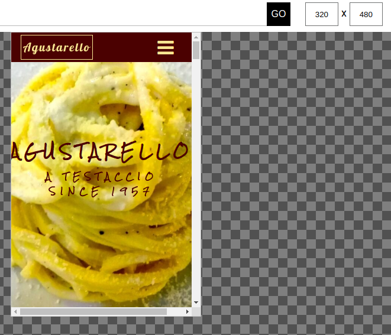
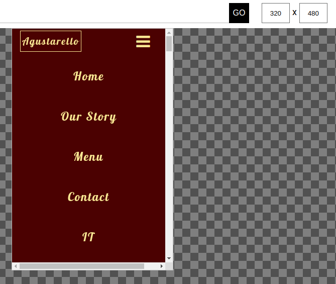
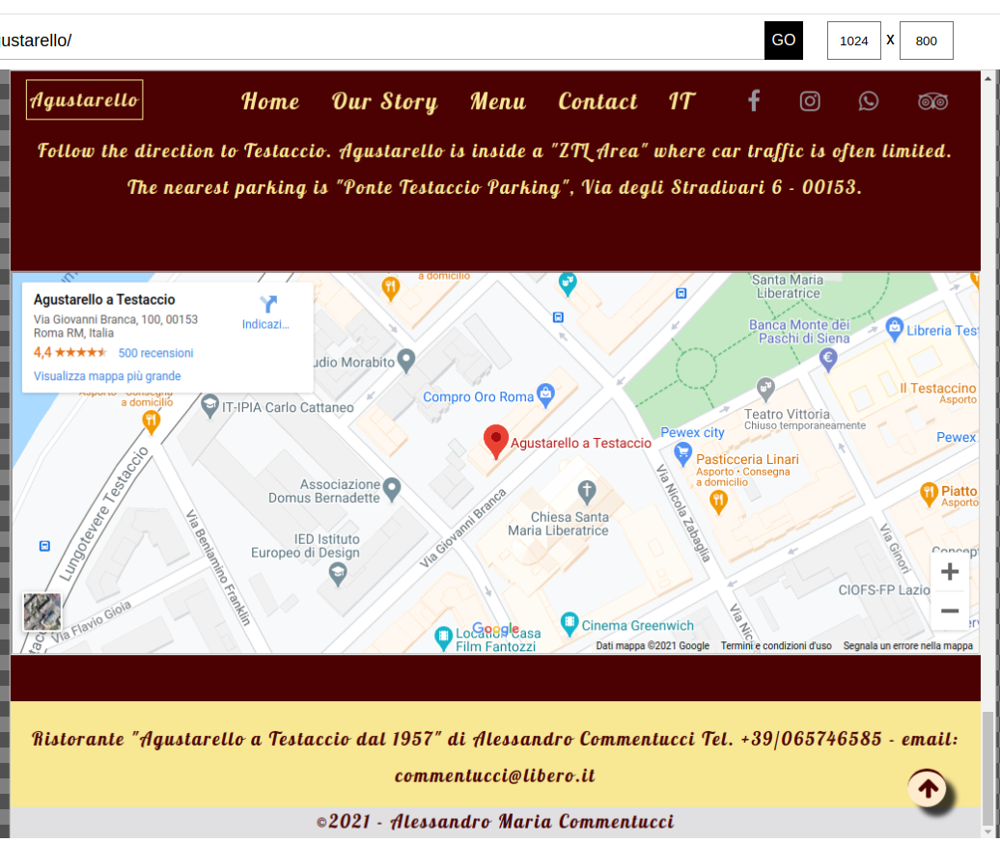
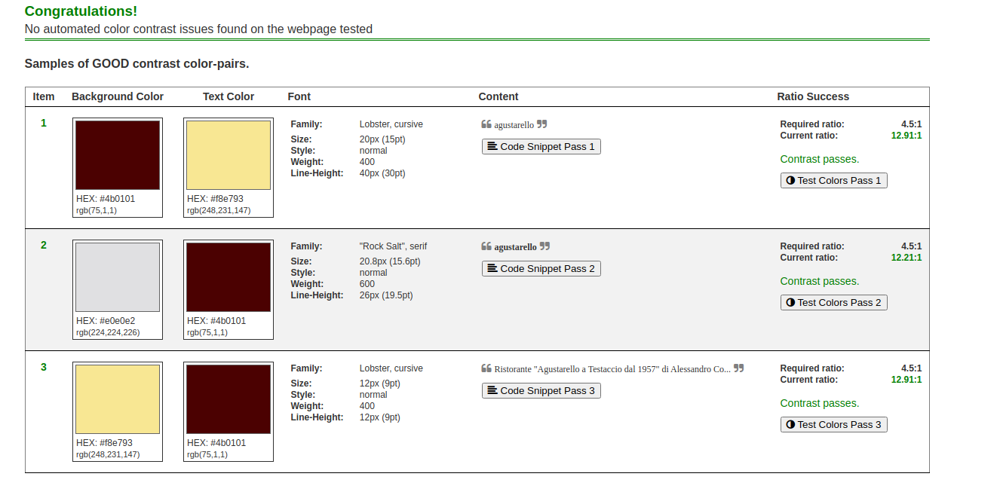
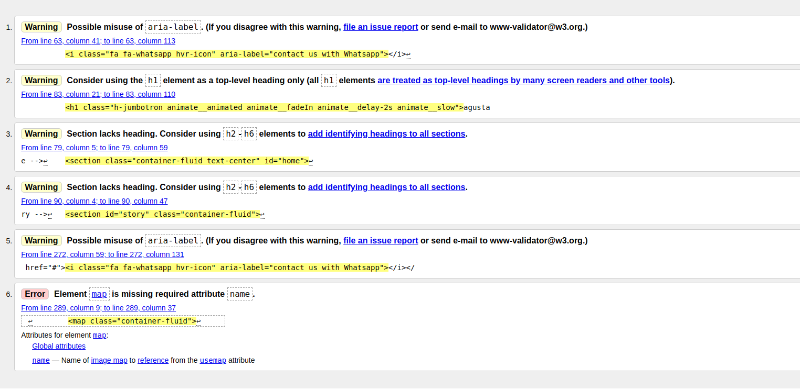

# Testing
## User stories
**As a customer:**
    
    - I want to book a table by the restaurant website so I can check the availabity of timing withouth calling the place.

that is a feature to implement in the future.

    - I want to check out a menu so I can see what kind of cuisine the restaurant is and how much is expensive

Once the site is open, I can navigate through the navigation bar to the menu section and open the link "take a look at the menu" and view menus and prices
    
    - I want to get direction for the restaurant so I can decide wich way is the best to get there (car or public transport)

I click on the contact section where there are directions on how to reach the restaurant by car or public transport as well as the frame of google maps with the location of the restaurant clearly indicated
    
    
    - I want to see some picture of the place and the food so I can get an early idea of the place

In the menu section I see a series of photos of the most characteristic dishes and scrolling through the site photos of the interiors to get an idea of ​​the place

    - I want to see some reviews from other customers who already been there because I trust of the reviews in internet

In the contact section there is the tripadvisor link that connects directly to the restaurant page on the reviews aggregator. Also through the navigation bar I can see the social links of the activity and check the reviews on facebook and comments on instagram.

## Links
- I checked that each navbar link worked correctly, in both the mobile navbar and the expanded desktop navbar.
- I checked that the links of the social pages worked correctly both those in the navbar and those in the contacts section.
- I checked that the navbar logo works correctly by redirecting the user to the homepage.
- The button to view the restaurant menu opens a new tab where the pdf menu is displayed correctly.
- The back to the top button takes you back to the home smoothly.
- Tested Carousel right and left arrows and the right arrow moves to the next image and left arrow moves to the previous image as desired.

## Transition and Animation
- The background transition of the logo in the navbar works correctly.
- The underline-border transitions of the navbar links works correctly.
- The icon grow transitions in the navbar and contact section social links works correctly.
- The jumbotron animations work correctly, both fade-in(title) and sliding(subtitle).
- The background fade transition of the link to the restaurant menu view works correctly.
- The back-to-the-top button grow effect works properly.

## Responsive design
- Tested responsiveness of the wireframe using Dev Tools and confirmed basic structure looks and works well on all mobile decides from 320px, up to desktop size.
- After testing my work on responsive design control, I noticed that on 360px screens the main title was being cut off. 
  

  
  
I found that the expanded navigation bar on screens below 580px in height cropped social icons. I solved both problems with specific media queries.
  

  
  
I also noticed that in some types of notebook screens the footer content went outside the margin. I used media queries to create three different footer font sizes at 768px, 992px and 1440px.
  

- Once these changes were optimized I finally tested the project with [Google Mobile-Friendly test](https://search.google.com/test/mobile-friendly).The test gave excellent results

## Accessibility
I tested the color choice of the site with [a11y](https://color.a11y.com/),  a Color Contrast Accessibility Validator,  and the test result was very positive.
.

## HTML validator
I ran [HTML Validator](https://validator.w3.org/) test. After testing the site, the report reported 5 warnings and 1 error.

I considered the warnings to be unimportant and fixed the reported error by adding name attribute to `<map>`.

## CSS validator
The [CSS validator](https://jigsaw.w3.org/css-validator/) did not find any errors.

## CSS Autoprefixer
Ran CSS through [Autoprefixer](https://autoprefixer.github.io/) and copied new CSS code back into style.css doc.

## Grammar and spelling
ran the readme.md and the testing.md through [online-spellcheck](https://www.online-spellcheck.com/).

## Lighthouse
The first test carried out gave the following results:

- ### Performance: **65**

- ### Accessibility: **98**

- ### Best Practices: **69**

- ### SEO: **92**

After making the required corrections, a new test gave the following results:

- ### Performance: **96**

- ### Accessibility: **100**

- ### Best Practices: **86**

- ### SEO: **100**

